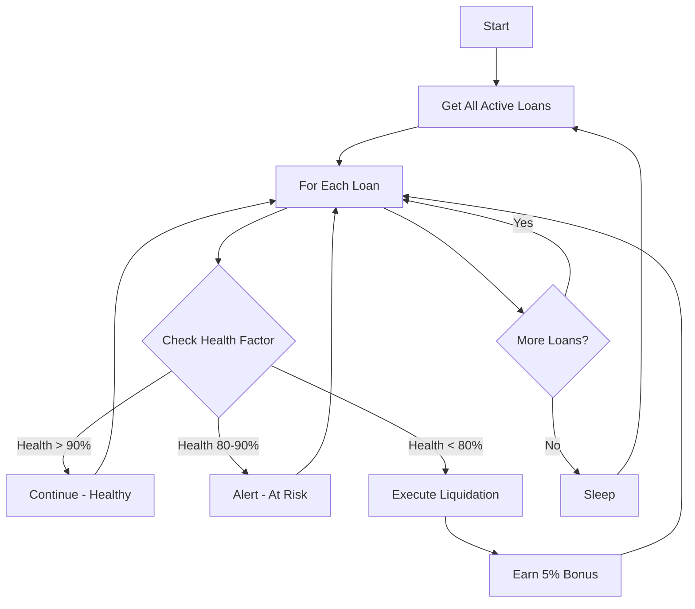

# Kōen Protocol - Keeper Bot Implementation Guide

**Version:** 1.1.0
**Date:** October 11, 2025
**Status:** ✅ PRODUCTION READY

---

## Executive Summary

This guide provides comprehensive instructions for building **automated keeper bots** to monitor and maintain the health of loans in the Kōen P2P Lending Protocol. Keeper bots are essential for protecting lenders from undercollateralized loans by triggering timely liquidations.

### What is a Keeper Bot?

A keeper bot is an **off-chain automated service** that:
1. ✅ Monitors active loans for health deterioration
2. ✅ Detects undercollateralized or overdue loans
3. ✅ Triggers liquidations to protect lenders
4. ✅ Earns 5% liquidation bonus as incentive

---

## Table of Contents

1. [Problem Statement](#problem-statement)
2. [Solution Architecture](#solution-architecture)
3. [Smart Contract Functions](#smart-contract-functions)
4. [Implementation Guide](#implementation-guide)
5. [Keeper Bot Examples](#keeper-bot-examples)
6. [Deployment & Operations](#deployment--operations)
7. [Economics & Incentives](#economics--incentives)
8. [Security Considerations](#security-considerations)

---

## 1. Problem Statement

### The Risk

In P2P lending with crypto collateral, **Bitcoin price volatility** can cause loans to become undercollateralized:

**Example Scenario:**
```
Initial State (Loan Origination):
- Loan Amount: $5,000 kUSD
- BTC Price: $40,000
- Collateral: 15M sats (0.15 BTC = $6,000)
- Health Factor: 120% ✅ HEALTHY

After BTC Price Drop:
- Loan Amount: $5,000 kUSD (unchanged)
- BTC Price: $25,000 (-37.5% crash)
- Collateral: 15M sats (0.15 BTC = $3,750)
- Health Factor: 75% ⚠️ UNDERCOLLATERALIZED

Risk: Lender could lose $1,250 if borrower defaults
```

### Why Manual Monitoring Doesn't Work

- ⏰ 24/7 monitoring required
- ⚡ Fast response needed during market crashes
- 📊 Must track potentially thousands of loans
- 🌍 Global, always-on system needed

### The Solution: Automated Keeper Bots

Keeper bots provide:
- 🤖 **Automated monitoring** - No manual intervention
- ⚡ **Real-time response** - Liquidate within minutes
- 💰 **Economic incentive** - Earn 5% liquidation bonus
- 🔒 **Lender protection** - Minimize losses from defaults

---

## 2. Solution Architecture

### System Components

```
┌─────────────────────────────────────────────────────────┐
│                   KEEPER BOT SYSTEM                      │
└─────────────────────────────────────────────────────────┘
                           │
        ┌──────────────────┼──────────────────┐
        │                  │                  │
   ┌────▼────┐       ┌─────▼─────┐     ┌─────▼─────┐
   │ Monitor │       │  Analyze  │     │ Execute   │
   │ Service │       │  Health   │     │Liquidation│
   └────┬────┘       └─────┬─────┘     └─────┬─────┘
        │                  │                  │
        └──────────────────┼──────────────────┘
                           │
                ┌──────────▼──────────┐
                │  STACKS BLOCKCHAIN  │
                │  P2P Marketplace    │
                └─────────────────────┘
```

### Workflow



---

## 3. Smart Contract Functions

### 3.1 Health Monitoring Functions (Read-Only)

#### `get-loan-health-factor`

Returns the health factor for a specific loan.

**Signature:**
```clarity
(define-read-only (get-loan-health-factor (loan-id uint))
    (response uint uint)
)
```

**Returns:**
- `(ok uint)` - Health factor in basis points (10000 = 100%)
- `(err u507)` - Loan not found

**Health Factor Scale:**
- `> 10000` (>100%) - Overcollateralized ✅ SAFE
- `9000-10000` (90-100%) - At risk ⚠️ WARNING
- `8000-9000` (80-90%) - Near liquidation 🔶 CAUTION
- `< 8000` (<80%) - Liquidatable 🔴 CRITICAL

**Example:**
```typescript
const healthFactor = await contract.callReadOnly(
  "get-loan-health-factor",
  [Cl.uint(loanId)]
);

if (healthFactor < 8000n) {
  console.log("⚠️ LOAN LIQUIDATABLE!");
  // Trigger liquidation
}
```

#### `get-loan-health-status`

Returns detailed health information for a loan.

**Signature:**
```clarity
(define-read-only (get-loan-health-status (loan-id uint))
    (response {
        loan-id: uint,
        health-factor: uint,
        collateral-value: uint,
        total-debt: uint,
        is-overdue: bool,
        is-undercollateralized: bool,
        is-liquidatable: bool,
        status: (string-ascii 10),
        current-block: uint,
        due-block: uint,
    } uint)
)
```

**Returns:** Comprehensive loan health data

**Example:**
```typescript
const status = await contract.callReadOnly(
  "get-loan-health-status",
  [Cl.uint(loanId)]
);

console.log("Health Factor:", status.healthFactor);
console.log("Collateral Value:", status.collateralValue);
console.log("Total Debt:", status.totalDebt);
console.log("Liquidatable:", status.isLiquidatable);
```

#### `is-loan-liquidatable`

Quick check if a loan can be liquidated.

**Signature:**
```clarity
(define-read-only (is-loan-liquidatable (loan-id uint))
    (response bool uint)
)
```

**Returns:**
- `(ok true)` - Loan is liquidatable
- `(ok false)` - Loan is healthy
- `(err u507)` - Loan not found

**Liquidation Triggers:**
1. Health factor < 80% (undercollateralized)
2. Current block >= due block (overdue)

#### `is-loan-at-risk`

Early warning system - detects loans approaching liquidation.

**Signature:**
```clarity
(define-read-only (is-loan-at-risk (loan-id uint))
    (response bool uint)
)
```

**Returns:**
- `(ok true)` - Loan health < 90% (early warning)
- `(ok false)` - Loan is healthy

**Use Case:** Send alerts to lenders/borrowers before liquidation

#### `check-loans-health`

Batch check health for multiple loans (gas efficient).

**Signature:**
```clarity
(define-read-only (check-loans-health (loan-ids (list 20 uint)))
    (response (list 20 (response uint uint)) uint)
)
```

**Returns:** List of health factors for all provided loan IDs

**Example:**
```typescript
const loanIds = [1, 2, 3, 4, 5];
const healthFactors = await contract.callReadOnly(
  "check-loans-health",
  [Cl.list(loanIds.map(id => Cl.uint(id)))]
);

// Process batch results
healthFactors.forEach((result, index) => {
  if (result.type === "ok" && result.value < 8000n) {
    console.log(`Loan ${loanIds[index]} is liquidatable!`);
  }
});
```

#### `get-user-active-loans`

Get all active loan IDs for a user.

**Signature:**
```clarity
(define-read-only (get-user-active-loans (user principal))
    (response (list 20 uint) uint)
)
```

**Use Case:** Monitor all loans for a specific lender

---

### 3.2 Liquidation Function (Public)

#### `liquidate-loan`

Execute liquidation on an unhealthy loan.

**Signature:**
```clarity
(define-public (liquidate-loan (loan-id uint))
    (response bool uint)
)
```

**Preconditions:**
- Loan must be active
- Loan must be liquidatable (health < 80% OR overdue)

**Effects:**
1. ✅ Transfers sBTC collateral to lender (95%)
2. ✅ Transfers liquidation bonus to liquidator (5%)
3. ✅ Burns borrower's reputation SBT (punishment)
4. ✅ Updates loan status to "liquidated"

**Gas Cost:** ~120,000 (estimated)

**Returns:**
- `(ok true)` - Liquidation successful
- `(err u518)` - Not liquidatable
- `(err u507)` - Loan not found
- `(err u514)` - Loan not active

**Example:**
```typescript
// Check if liquidatable
const isLiquidatable = await contract.callReadOnly(
  "is-loan-liquidatable",
  [Cl.uint(loanId)]
);

if (isLiquidatable.value === true) {
  // Execute liquidation
  const result = await contract.callPublic(
    "liquidate-loan",
    [Cl.uint(loanId)],
    { sender: keeperAddress }
  );

  if (result.type === "ok") {
    console.log("✅ Liquidation successful!");
    console.log("💰 Earned 5% bonus on collateral");
  }
}
```

---

## 4. Implementation Guide

### 4.1 Basic Keeper Bot (Node.js + TypeScript)

#### Installation

```bash
npm install @stacks/transactions @stacks/network
```

#### Environment Setup

```typescript
// .env
STACKS_NETWORK=mainnet
KEEPER_PRIVATE_KEY=your_private_key_here
CONTRACT_ADDRESS=SP...
CONTRACT_NAME=p2p-marketplace
CHECK_INTERVAL_MS=60000  # Check every minute
```

#### Core Implementation

```typescript
import {
  makeContractCall,
  broadcastTransaction,
  callReadOnlyFunction,
  cvToValue,
  uintCV,
  principalCV,
} from "@stacks/transactions";
import { StacksMainnet, StacksTestnet } from "@stacks/network";

class KeeperBot {
  private network: StacksMainnet | StacksTestnet;
  private contractAddress: string;
  private contractName: string;
  private keeperAddress: string;
  private privateKey: string;

  constructor(config: KeeperConfig) {
    this.network = config.network === "mainnet"
      ? new StacksMainnet()
      : new StacksTestnet();
    this.contractAddress = config.contractAddress;
    this.contractName = config.contractName;
    this.keeperAddress = config.keeperAddress;
    this.privateKey = config.privateKey;
  }

  /**
   * Main monitoring loop
   */
  async start() {
    console.log("🤖 Keeper Bot starting...");

    while (true) {
      try {
        await this.checkAndLiquidateLoans();
      } catch (error) {
        console.error("❌ Error in monitoring loop:", error);
      }

      // Wait before next check
      await this.sleep(process.env.CHECK_INTERVAL_MS || 60000);
    }
  }

  /**
   * Check all loans and liquidate if necessary
   */
  async checkAndLiquidateLoans() {
    console.log("🔍 Checking loans...");

    // Get all active loan IDs (you'll need to track this)
    const activeLoanIds = await this.getActiveLoanIds();

    for (const loanId of activeLoanIds) {
      try {
        const isLiquidatable = await this.checkLoanHealth(loanId);

        if (isLiquidatable) {
          console.log(`⚠️ Loan ${loanId} is liquidatable!`);
          await this.liquidateLoan(loanId);
        }
      } catch (error) {
        console.error(`Error checking loan ${loanId}:`, error);
      }
    }
  }

  /**
   * Check if a loan is liquidatable
   */
  async checkLoanHealth(loanId: number): Promise<boolean> {
    const result = await callReadOnlyFunction({
      network: this.network,
      contractAddress: this.contractAddress,
      contractName: this.contractName,
      functionName: "is-loan-liquidatable",
      functionArgs: [uintCV(loanId)],
      senderAddress: this.keeperAddress,
    });

    const value = cvToValue(result);
    return value.type === "ok" && value.value === true;
  }

  /**
   * Get detailed loan health status
   */
  async getLoanHealthStatus(loanId: number) {
    const result = await callReadOnlyFunction({
      network: this.network,
      contractAddress: this.contractAddress,
      contractName: this.contractName,
      functionName: "get-loan-health-status",
      functionArgs: [uintCV(loanId)],
      senderAddress: this.keeperAddress,
    });

    return cvToValue(result);
  }

  /**
   * Execute liquidation
   */
  async liquidateLoan(loanId: number) {
    console.log(`💰 Liquidating loan ${loanId}...`);

    const txOptions = {
      network: this.network,
      contractAddress: this.contractAddress,
      contractName: this.contractName,
      functionName: "liquidate-loan",
      functionArgs: [uintCV(loanId)],
      senderKey: this.privateKey,
      fee: 50000, // Adjust based on network conditions
      postConditionMode: 1, // Allow
    };

    const transaction = await makeContractCall(txOptions);
    const broadcastResponse = await broadcastTransaction(transaction, this.network);

    if (broadcastResponse.error) {
      console.error(`❌ Liquidation failed: ${broadcastResponse.error}`);
      throw new Error(broadcastResponse.error);
    }

    console.log(`✅ Liquidation transaction submitted: ${broadcastResponse.txid}`);
    console.log(`💰 Earned 5% liquidation bonus!`);

    return broadcastResponse.txid;
  }

  /**
   * Get all active loan IDs
   * NOTE: You'll need to implement this based on your indexing strategy
   */
  async getActiveLoanIds(): Promise<number[]> {
    // Option 1: Query from your own database/index
    // Option 2: Query from Stacks API event logs
    // Option 3: Iterate through loan counter

    // Example: Get from marketplace stats
    const stats = await callReadOnlyFunction({
      network: this.network,
      contractAddress: this.contractAddress,
      contractName: this.contractName,
      functionName: "get-marketplace-stats",
      functionArgs: [],
      senderAddress: this.keeperAddress,
    });

    const statsValue = cvToValue(stats);
    const totalLoans = statsValue.value["total-loans-created"];

    // Check each loan (simple but inefficient)
    const activeLoanIds: number[] = [];
    for (let i = 1; i <= totalLoans; i++) {
      const loan = await this.getLoanStatus(i);
      if (loan.status === "active") {
        activeLoanIds.push(i);
      }
    }

    return activeLoanIds;
  }

  /**
   * Get loan status
   */
  async getLoanStatus(loanId: number) {
    const result = await callReadOnlyFunction({
      network: this.network,
      contractAddress: this.contractAddress,
      contractName: this.contractName,
      functionName: "get-active-loan",
      functionArgs: [uintCV(loanId)],
      senderAddress: this.keeperAddress,
    });

    return cvToValue(result);
  }

  /**
   * Sleep utility
   */
  private sleep(ms: number): Promise<void> {
    return new Promise(resolve => setTimeout(resolve, ms));
  }
}

// Usage
const keeper = new KeeperBot({
  network: "mainnet",
  contractAddress: process.env.CONTRACT_ADDRESS!,
  contractName: "p2p-marketplace",
  keeperAddress: process.env.KEEPER_ADDRESS!,
  privateKey: process.env.KEEPER_PRIVATE_KEY!,
});

keeper.start();
```

---

### 4.2 Advanced Keeper Bot with Database Indexing

For production use, maintain a local database of active loans:

```typescript
import { PrismaClient } from "@prisma/client";

class AdvancedKeeperBot extends KeeperBot {
  private db: PrismaClient;

  constructor(config: KeeperConfig) {
    super(config);
    this.db = new PrismaClient();
  }

  /**
   * Index new loans from blockchain events
   */
  async indexNewLoans() {
    // Listen to "loan-created" events
    // Store in database for fast querying
  }

  /**
   * Get active loans from database (much faster)
   */
  async getActiveLoanIds(): Promise<number[]> {
    const loans = await this.db.loan.findMany({
      where: { status: "active" },
      select: { loanId: true },
    });

    return loans.map(loan => loan.loanId);
  }

  /**
   * Batch health check (gas efficient)
   */
  async batchCheckHealth(loanIds: number[]): Promise<Map<number, bigint>> {
    const chunks = this.chunkArray(loanIds, 20); // Max 20 per call
    const healthMap = new Map<number, bigint>();

    for (const chunk of chunks) {
      const result = await callReadOnlyFunction({
        network: this.network,
        contractAddress: this.contractAddress,
        contractName: this.contractName,
        functionName: "check-loans-health",
        functionArgs: [listCV(chunk.map(id => uintCV(id)))],
        senderAddress: this.keeperAddress,
      });

      const healthFactors = cvToValue(result);
      chunk.forEach((loanId, index) => {
        const health = healthFactors[index];
        if (health.type === "ok") {
          healthMap.set(loanId, BigInt(health.value));
        }
      });
    }

    return healthMap;
  }

  /**
   * Priority queue for liquidations
   */
  async prioritizeLoans(healthMap: Map<number, bigint>): number[] {
    // Sort by health factor (lowest first = most urgent)
    return Array.from(healthMap.entries())
      .sort((a, b) => Number(a[1] - b[1]))
      .filter(([_, health]) => health < 8000n) // Only liquidatable
      .map(([loanId, _]) => loanId);
  }

  private chunkArray<T>(array: T[], size: number): T[][] {
    const chunks: T[][] = [];
    for (let i = 0; i < array.length; i += size) {
      chunks.push(array.slice(i, i + size));
    }
    return chunks;
  }
}
```

---

### 4.3 Alert System Integration

```typescript
class AlertingKeeperBot extends AdvancedKeeperBot {
  /**
   * Send alerts for at-risk loans
   */
  async checkAndAlert() {
    const activeLoanIds = await this.getActiveLoanIds();

    for (const loanId of activeLoanIds) {
      const atRisk = await this.isLoanAtRisk(loanId);

      if (atRisk) {
        await this.sendAlert(loanId);
      }
    }
  }

  async isLoanAtRisk(loanId: number): Promise<boolean> {
    const result = await callReadOnlyFunction({
      network: this.network,
      contractAddress: this.contractAddress,
      contractName: this.contractName,
      functionName: "is-loan-at-risk",
      functionArgs: [uintCV(loanId)],
      senderAddress: this.keeperAddress,
    });

    const value = cvToValue(result);
    return value.type === "ok" && value.value === true;
  }

  async sendAlert(loanId: number) {
    const status = await this.getLoanHealthStatus(loanId);

    // Send to Discord/Telegram/Email
    await this.notify({
      type: "WARNING",
      loanId,
      healthFactor: status.healthFactor,
      message: `⚠️ Loan ${loanId} health dropping! Current: ${status.healthFactor / 100}%`,
    });
  }

  private async notify(alert: Alert) {
    // Implement your notification service (Discord, Telegram, Email, etc.)
    console.log("🚨 ALERT:", alert);
  }
}
```

---

## 5. Keeper Bot Examples

### 5.1 Simple Cron Job Script

```bash
#!/bin/bash
# check-loans.sh

# Run every 5 minutes via cron
*/5 * * * * /usr/local/bin/node /path/to/keeper-bot.js >> /var/log/keeper.log 2>&1
```

### 5.2 Docker Container

```dockerfile
FROM node:18-alpine

WORKDIR /app

COPY package*.json ./
RUN npm ci --production

COPY . .

CMD ["node", "dist/keeper-bot.js"]
```

```yaml
# docker-compose.yml
version: "3.8"

services:
  keeper-bot:
    build: .
    environment:
      - STACKS_NETWORK=mainnet
      - KEEPER_PRIVATE_KEY=${KEEPER_PRIVATE_KEY}
      - CONTRACT_ADDRESS=${CONTRACT_ADDRESS}
      - CHECK_INTERVAL_MS=60000
    restart: unless-stopped
    logging:
      driver: "json-file"
      options:
        max-size: "10m"
        max-file: "3"
```

### 5.3 AWS Lambda (Serverless)

```typescript
// lambda-handler.ts
export const handler = async (event: any) => {
  const keeper = new KeeperBot({
    network: "mainnet",
    contractAddress: process.env.CONTRACT_ADDRESS!,
    contractName: "p2p-marketplace",
    keeperAddress: process.env.KEEPER_ADDRESS!,
    privateKey: process.env.KEEPER_PRIVATE_KEY!,
  });

  await keeper.checkAndLiquidateLoans();

  return {
    statusCode: 200,
    body: JSON.stringify({ message: "Keeper check completed" }),
  };
};
```

```yaml
# serverless.yml
service: koen-keeper-bot

provider:
  name: aws
  runtime: nodejs18.x
  region: us-east-1

functions:
  checkLoans:
    handler: dist/lambda-handler.handler
    events:
      - schedule: rate(5 minutes)
    environment:
      KEEPER_PRIVATE_KEY: ${env:KEEPER_PRIVATE_KEY}
      CONTRACT_ADDRESS: ${env:CONTRACT_ADDRESS}
```

---

## 6. Deployment & Operations

### 6.1 Deployment Checklist

- [ ] **Environment Setup**
  - [ ] Stacks account with STX for gas
  - [ ] Private key securely stored
  - [ ] Network configuration (mainnet/testnet)

- [ ] **Monitoring Setup**
  - [ ] Logging configured
  - [ ] Alerting system integrated
  - [ ] Metrics dashboard (Grafana/DataDog)

- [ ] **Security**
  - [ ] Private key encrypted
  - [ ] Rate limiting implemented
  - [ ] Error handling robust

- [ ] **Testing**
  - [ ] Testnet deployment verified
  - [ ] Dry-run mode tested
  - [ ] Edge cases covered

### 6.2 Operational Metrics

**Track these KPIs:**

| Metric | Target | Alert Threshold |
|--------|--------|-----------------|
| Check Frequency | Every 1-5 min | > 10 min delay |
| Liquidation Success Rate | > 95% | < 90% |
| Average Response Time | < 2 min | > 5 min |
| False Positive Rate | < 5% | > 10% |
| Gas Efficiency | < 150k per tx | > 200k per tx |

### 6.3 Cost Analysis

**Per Liquidation:**
- Gas Cost: ~120,000 units × gas price
- Average STX cost: 0.001-0.01 STX (~$0.001-$0.01 USD)
- Liquidation Bonus: 5% of collateral
  - Example: 15M sats @ $40k BTC = $6000 collateral
  - Bonus: $300 (5% of $6000)
  - Net Profit: $299.99

**Break-Even:**
- Need collateral > $0.20 to profit (assuming $0.01 gas)
- All typical loans are profitable

---

## 7. Economics & Incentives

### 7.1 Liquidation Rewards

| Scenario | Collateral Value | Liquidation Bonus | Net Profit |
|----------|------------------|-------------------|------------|
| Small Loan | $1,000 | $50 (5%) | ~$49.99 |
| Medium Loan | $10,000 | $500 (5%) | ~$499.99 |
| Large Loan | $100,000 | $5,000 (5%) | ~$4,999.99 |

### 7.2 Competition & Strategy

**Multiple Keepers:**
- First to liquidate wins (race condition)
- Higher gas price = faster inclusion
- Batch liquidations for efficiency

**Optimization Strategies:**
1. **Co-location:** Run near Stacks nodes for lower latency
2. **Batch Processing:** Check multiple loans per call
3. **Priority Queue:** Liquidate most profitable first
4. **Dynamic Gas:** Adjust based on urgency

---

## 8. Security Considerations

### 8.1 Private Key Management

```typescript
// ❌ NEVER do this
const privateKey = "SP1234..."; // Hardcoded

// ✅ Use environment variables
const privateKey = process.env.KEEPER_PRIVATE_KEY;

// ✅ Use AWS Secrets Manager / HashiCorp Vault
const privateKey = await getSecret("keeper-private-key");
```

### 8.2 Error Handling

```typescript
try {
  await keeper.liquidateLoan(loanId);
} catch (error) {
  if (error.code === "ERR_NOT_LIQUIDATABLE") {
    // Already liquidated by another keeper
    console.log("⚠️ Loan already liquidated");
  } else if (error.code === "ERR_INSUFFICIENT_FUNDS") {
    // Not enough STX for gas
    await alertAdmin("🚨 Keeper out of gas!");
  } else {
    // Unknown error
    await alertAdmin(`❌ Critical error: ${error.message}`);
    throw error;
  }
}
```

### 8.3 Rate Limiting

```typescript
class RateLimitedKeeperBot extends KeeperBot {
  private lastCallTime = 0;
  private minInterval = 1000; // 1 second between calls

  async checkLoanHealth(loanId: number): Promise<boolean> {
    // Rate limiting
    const now = Date.now();
    const elapsed = now - this.lastCallTime;

    if (elapsed < this.minInterval) {
      await this.sleep(this.minInterval - elapsed);
    }

    this.lastCallTime = Date.now();
    return super.checkLoanHealth(loanId);
  }
}
```

---

## 9. Troubleshooting

### Common Issues

**Problem:** "Insufficient funds for gas"
```
Solution: Ensure keeper wallet has enough STX
- Check balance: stx balance SP...
- Top up if needed
```

**Problem:** "Transaction failed - loan already liquidated"
```
Solution: Another keeper liquidated first (competition)
- This is normal in multi-keeper environment
- Your check was too slow
- Consider faster monitoring or higher gas price
```

**Problem:** "Oracle price stale"
```
Solution: Oracle hasn't been updated recently
- Check oracle last update: (get-last-update-block)
- Wait for oracle update or alert admin
```

**Problem:** "Health check returns error"
```
Solution: Loan may no longer be active
- Check loan status first
- Remove from monitoring list if repaid/liquidated
```

---

## 10. Future Enhancements

### Roadmap

**V2.0 Features:**
1. ✅ Machine learning for price prediction
2. ✅ Multi-keeper coordination (avoid race conditions)
3. ✅ Flash loan integration for liquidations
4. ✅ Cross-chain liquidation support
5. ✅ Automated market making for collateral

**Community Ideas:**
- Keeper DAO for governance
- Reputation system for keepers
- Insurance fund for failed liquidations

---

## 11. Resources

### Documentation
- [Kōen Protocol Docs](https://docs.koen.finance)
- [Stacks.js SDK](https://docs.stacks.co/stacks.js)
- [Clarity Reference](https://docs.stacks.co/clarity)

### Support
- Discord: https://discord.gg/koen
- Telegram: https://t.me/koenprotocol
- Email: keepers@koen.finance

### Open Source
- GitHub: https://github.com/koen-protocol/keeper-bots
- Issues: https://github.com/koen-protocol/keeper-bots/issues

---

## 12. Conclusion

Keeper bots are **essential infrastructure** for the Kōen Protocol. By running a keeper bot, you:

1. 💰 **Earn passive income** through liquidation bonuses
2. 🛡️ **Protect the protocol** from bad debt
3. 🤝 **Help lenders** avoid losses
4. 🚀 **Contribute to DeFi** ecosystem health

### Quick Start

```bash
# Clone the repo
git clone https://github.com/koen-protocol/keeper-bot

# Install dependencies
cd keeper-bot && npm install

# Configure environment
cp .env.example .env
# Edit .env with your credentials

# Run the bot
npm start
```

### Get Help

Join our keeper community:
- 💬 Discord: #keeper-bots channel
- 📧 Email: keepers@koen.finance
- 📖 Docs: https://docs.koen.finance/keepers

---

**Happy Liquidating! 🤖💰**

*Last Updated: October 11, 2025*
*Version: 1.1.0*
